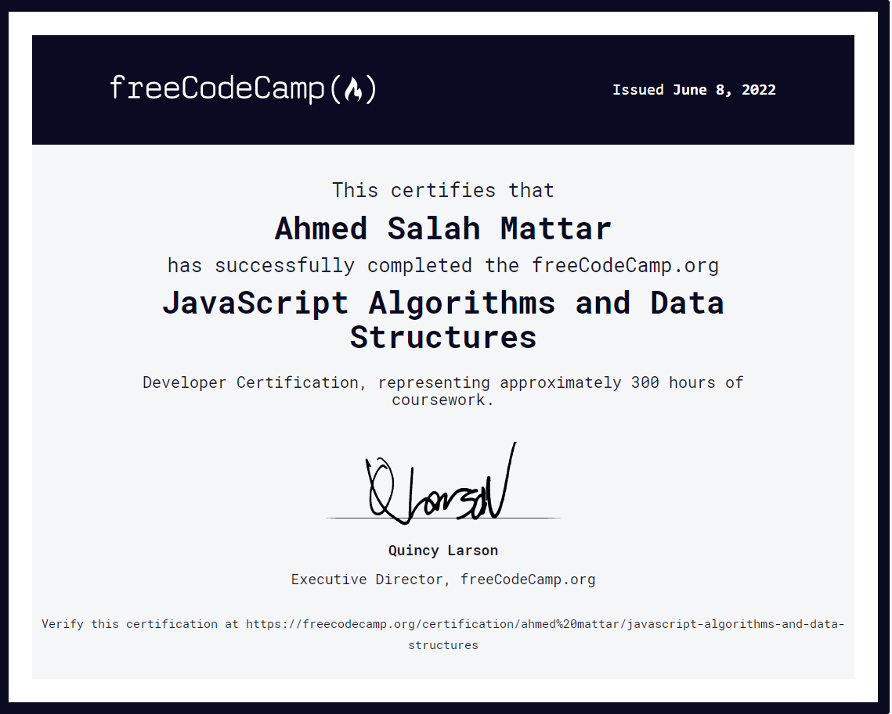

# JavaScript Algorithms and Data Structures sections covered

## Basic JavaScript

covers fundamental programming concepts in JavaScript. basic data structures like numbers and strings. Then work with arrays, objects, functions, loops, if/else statements, and more.

## ES6

ECMAScript, or ES, is a standardized version of JavaScript.
ES6, released in 2015, added many powerful new features to the language. In this course, I Learned these new features, including arrow functions, destructuring, classes, promises, and modules.

## Regular Expressions

Regular expressions, often shortened to "regex" or "regexp", are patterns that help programmers match, search, and replace text. Regular expressions are very powerful, but can be hard to read because they use special characters to make more complex, flexible matches.

In this course, I learned how to use special characters, capture groups, positive and negative lookaheads, and other techniques to match any text I want.

## Debugging

Debugging is the process of going through your code, finding any issues, and fixing them.

Issues in code generally come in three forms: syntax errors that prevent your program from running, runtime errors where your code has unexpected behavior, or logical errors where your code doesn't do what you intended.

In this course, I learned how to use the JavaScript console to debug programs and prevent common issues before they happen.

## Basic Data Structures

An algorithm is a series of step-by-step instructions that describe how to do something.

To write an effective algorithm, it helps to break a problem down into smaller parts and think carefully about how to solve each part with code.

In this course, I learned the fundamentals of algorithmic thinking by writing algorithms that do everything from converting temperatures to handling complex 2D arrays.

## Object Oriented Programming

OOP, or Object Oriented Programming, is one of the major approaches to the software development process. In OOP, objects and classes organize code to describe things and what they can do.

In this course, I learned the basic principles of OOP in JavaScript, including the `this` keyword, prototype chains, constructors, and inheritance.

## Functional Programming

Functional Programming is another popular approach to software development. In Functional Programming, code is organized into smaller, basic functions that can be combined to build complex programs.

In this course, I Learned the core concepts of Functional Programming including pure functions, how to avoid mutations, and how to write cleaner code with methods like `.map()` and `.filter()`.

## Intermediate Algorithm Scripting

Solved more than 20 probelm used every thing covered in the previous sections

## JavaScript Algorithms and Data Structures Projects

Completed 5 projects using typescript a superset of javascript.

